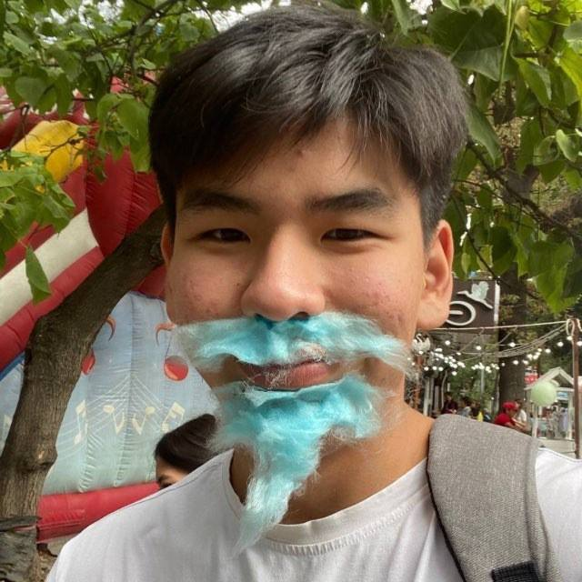

<h1 align="center">Hi there, I'm Alydin

</h1>

###

###

###

  

###

- 🌱 I’m currently learning ****Spring** and **Java**!**

- 💬 Ask me about ****Spring**, **Java**, or anything related to **backend development**!**

- 📫 How to reach me **alykulovalydin@gmail.com**

###

  
  
  
  
  
  
  
  
  
  

###

  
  

###

  
  
  

###

 

###

  

###
