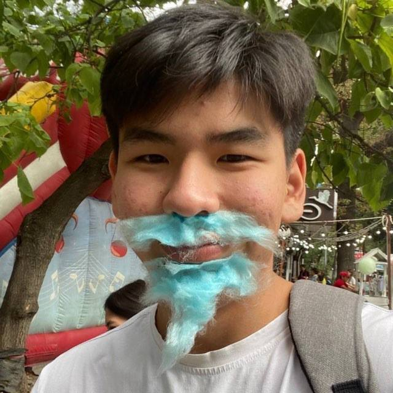

<div align="center">

<!-- HEADER BANNER -->


</div>

<!-- TERMINAL INTRO -->
```
    ╔═══════════════════════════════════════════════════════════════════════════════════════════════════════════════════════════════════════════════════════╗
    ║                                                                                                                                                       ║
    ║   $ whoami                                                                                                                                            ║
    ║   > alydin — backend engineer who turns coffee into microservices                                                                                     ║
    ║                                                                                                                                                       ║
    ║   $ uptime                                                                                                                                            ║
    ║   > coding since 2022 · still compiling…                                                                                                              ║
    ║                                                                                                                                                       ║
    ║   $ cat /etc/motto                                                                                                                                    ║
    ║   > "Write code that even your future self can understand."                                                                                           ║
    ║                                                                                                                                                       ║
    ╚═══════════════════════════════════════════════════════════════════════════════════════════════════════════════════════════════════════════════════════╝
```

<div align="center">


<br/>

<!-- PROFILE VIEWS & FOLLOWERS -->

&nbsp;


</div>

<br/>

<!-- ═══════════════════════════════ ABOUT ═══════════════════════════════ -->


<h2>

&nbsp; System Info
</h2>



```yaml
name: Alydin Alykulov
location: Kyrgyzstan 🇰🇬
role: Backend Developer
education: Software Engineering
languages: [Java, SQL, Python]
interests: [Microservices, System Design, Cloud Architecture]
currently_learning: [Spring Boot, Docker, Kubernetes]
fun_fact: "I debug with print statements and I'm not ashamed"
```

<br clear="both"/>

<!-- ═══════════════════════════════ TECH STACK ═══════════════════════════════ -->


<h2>
⚡ Tech Arsenal
</h2>

<div align="center">

<table>
<tr>
<td align="center" width="140">
<h4>Languages</h4>

</td>
<td align="center" width="140">
<h4>Frameworks</h4>

</td>
<td align="center" width="140">
<h4>Databases</h4>

</td>
<td align="center" width="140">
<h4>DevOps</h4>

</td>
<td align="center" width="140">
<h4>Tools</h4>

</td>
</tr>
</table>

</div>

<!-- ═══════════════════════════════ STATS ═══════════════════════════════ -->


<h2>
📊 Mission Telemetry
</h2>

<div align="center">

<picture>
  <source media="(prefers-color-scheme: dark)" srcset="https://github-readme-stats.vercel.app/api?username=alydinus&show_icons=true&hide_border=true&bg_color=0d1117&title_color=58a6ff&icon_color=58a6ff&text_color=c9d1d9&include_all_commits=true&count_private=true&custom_title=%F0%9F%93%A1%20Signal%20Strength"/>
  
</picture>
&nbsp;&nbsp;
<picture>
  <source media="(prefers-color-scheme: dark)" srcset="https://github-readme-stats.vercel.app/api/top-langs/?username=alydinus&layout=compact&hide_border=true&bg_color=0d1117&title_color=58a6ff&text_color=c9d1d9&langs_count=6&custom_title=%F0%9F%9B%B0%EF%B8%8F%20Payload%20Distribution"/>
  
</picture>

<br/><br/>

<picture>
  <source media="(prefers-color-scheme: dark)" srcset="https://github-readme-streak-stats.herokuapp.com?user=alydinus&hide_border=true&background=0d1117&stroke=161b22&ring=58a6ff&fire=58a6ff&currStreakNum=c9d1d9&sideNums=c9d1d9&currStreakLabel=58a6ff&sideLabels=8b949e&dates=6e7681"/>
  
</picture>

</div>

<!-- ═══════════════════════════════ GRAPH ═══════════════════════════════ -->


<h2>
📈 Activity Radar
</h2>

<div align="center">

<picture>
  <source media="(prefers-color-scheme: dark)" srcset="https://github-readme-activity-graph.vercel.app/graph?username=alydinus&bg_color=0d1117&color=58a6ff&line=58a6ff&point=c9d1d9&area_color=161b22&area=true&hide_border=true&custom_title=Commit%20Frequency%20Analysis"/>
  
</picture>

</div>

<!-- ═══════════════════════════════ TROPHIES ═══════════════════════════════ -->


<h2>
🏆 Achievement Log
</h2>

<div align="center">


</div>

<!-- ═══════════════════════════════ SNAKE ═══════════════════════════════ -->


<h2>
🐍 Contribution Consumption
</h2>

<div align="center">

<picture>
  <source media="(prefers-color-scheme: dark)" srcset="https://raw.githubusercontent.com/alydinus/alydinus/output/snake.svg"/>
  
</picture>

</div>

<!-- ═══════════════════════════════ CONNECT ═══════════════════════════════ -->


<h2>
🔗 Open Channels
</h2>

<div align="center">

<a href="mailto:alykulovalydin@gmail.com">

</a>
&nbsp;
<a href="https://www.linkedin.com/in/%D0%B0%D0%BB%D1%8B%D0%B4%D0%B8%D0%BD-%D0%B0%D0%BB%D1%8B%D0%BA%D1%83%D0%BB%D0%BE%D0%B2-bb2a11366/">

</a>
&nbsp;
<a href="https://t.me/alydinnnn">

</a>
&nbsp;
<a href="https://www.instagram.com/alydinus">

</a>

</div>

<br/>

<!-- FOOTER -->
<div align="center">

```
  ┌──────────────────────────────────────────────────────────┐
  │                                                          │
  │   Thanks for visiting! May your code compile on the      │
  │   first try and your tests always pass. 🚀               │
  │                                                          │
  │   ▀▀▀▀▀▀▀▀▀▀▀▀▀▀▀▀▀▀▀▀▀▀▀▀▀▀▀▀▀▀▀▀▀▀▀▀▀▀▀▀▀▀▀▀▀▀▀▀▀▀     │
  │   EOF — Connection closed.                               │
  │                                                          │
  └──────────────────────────────────────────────────────────┘
```

</div>


